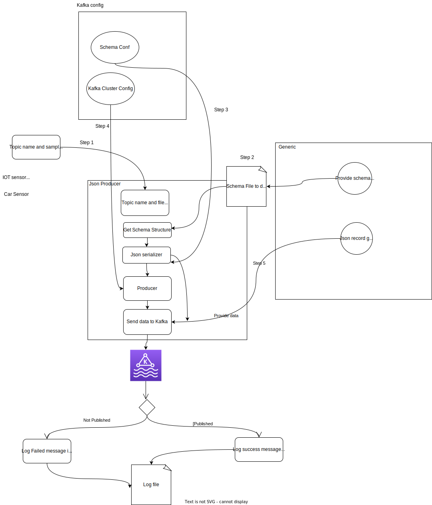
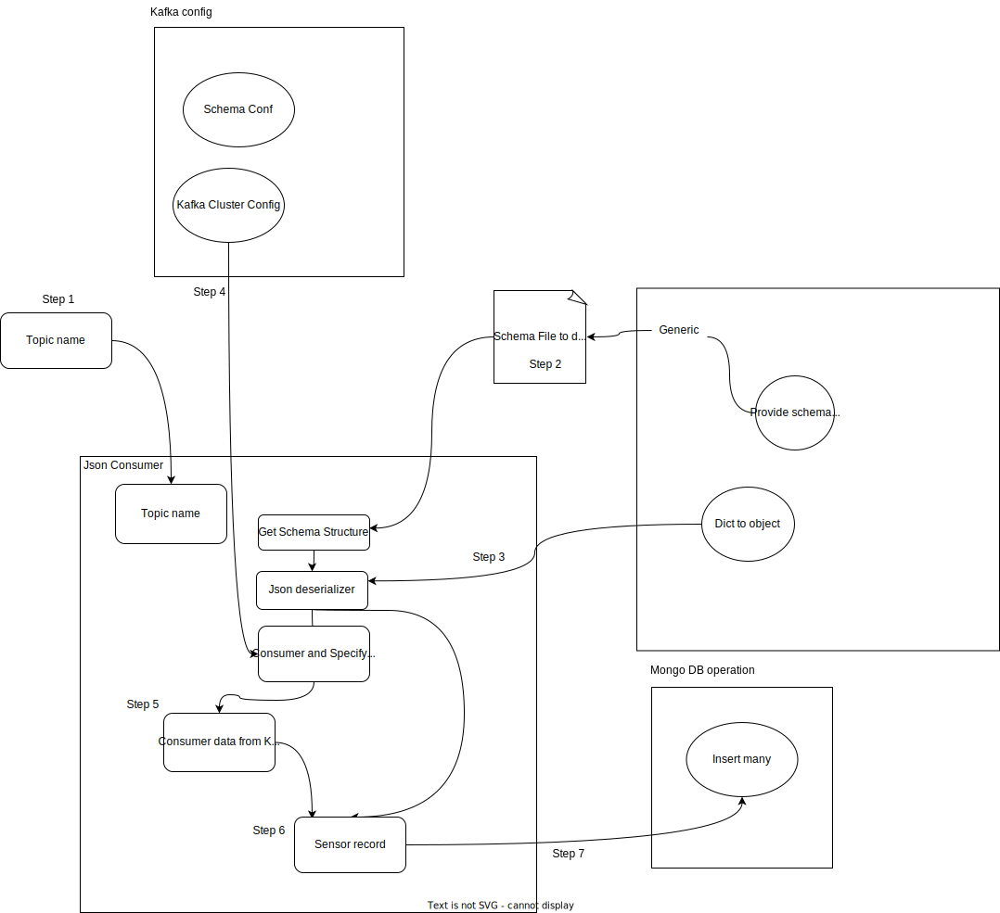

# confluent-kafka-python

This repo help us to know how to publish and consume data to and from kafka confluent in json format.
### Producer


### Consumer


## Project Implementation
Step 1: Create a conda environment
```
conda --version
```

Step2: Create  a conda environment
```
conda create -p venv python==3.10 -y
```

Step3:
```
conda activate venv/
```
Step4:
```
pip install -r requirements.txt
```

Below repo help you to obtain requried credentials


Cluster Environment Variable
```
CLUSTER_API_KEY=""
CLUSTER_API_SECRET=""
BOOTSTRAP_SERVER=""
SECURITY_PROTOCOL=""
SSL_MACHENISM=""
```


Schema related Environment Variable
```
SCHEMA_REGISTRY_API_KEY=""
SCHEMA_REGISTRY_API_SECRET=""
ENDPOINT_SCHEMA_URL=""

```
Data base related Environment Variable
```
MONGO_DB_URL=""
```

## Update the credential in .env file and run below command to run your application in docker container


Create .env file in root dir of your project if it is not available
paste the below content and update the credentials
```
CLUSTER_API_KEY=""
CLUSTER_API_SECRET=""
BOOTSTRAP_SERVER=""
SECURITY_PROTOCOL=""
SSL_MACHENISM=""

SCHEMA_REGISTRY_API_KEY=""
SCHEMA_REGISTRY_API_SECRET=""
ENDPOINT_SCHEMA_URL=""

MONGO_DB_URL=""
```

Build docker image
```
docker build -t data-pipeline:lts .
```

For linux or mac
Run docker image
```
docker run -it -v $(pwd)/logs:/logs  --env-file=$(pwd)/.env data-pipeline:lts
```