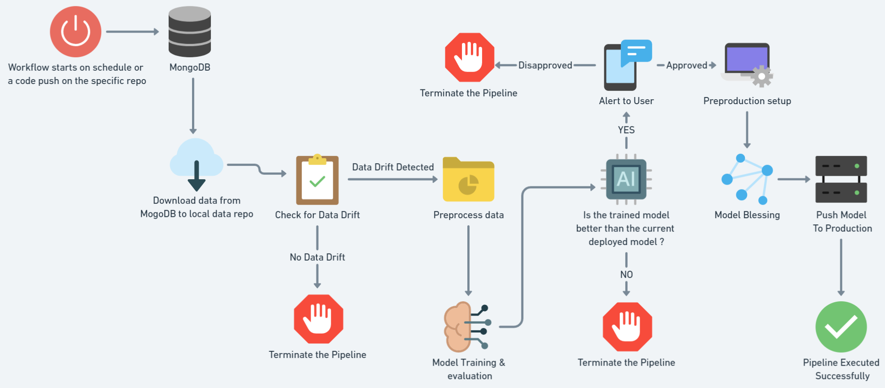
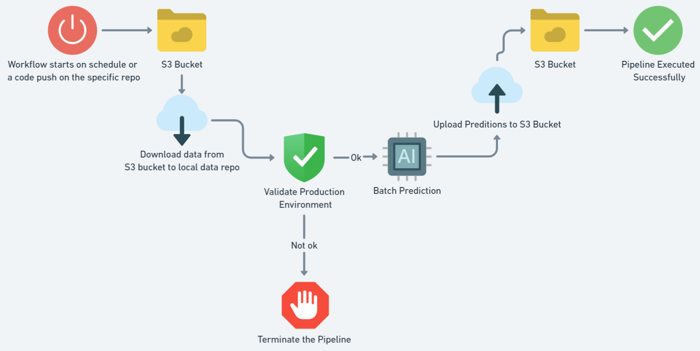
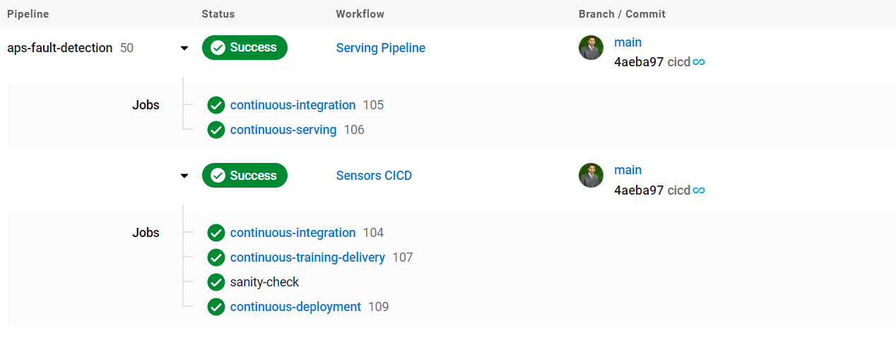
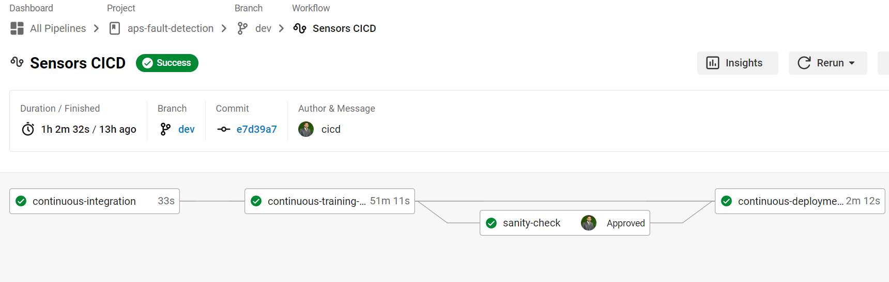
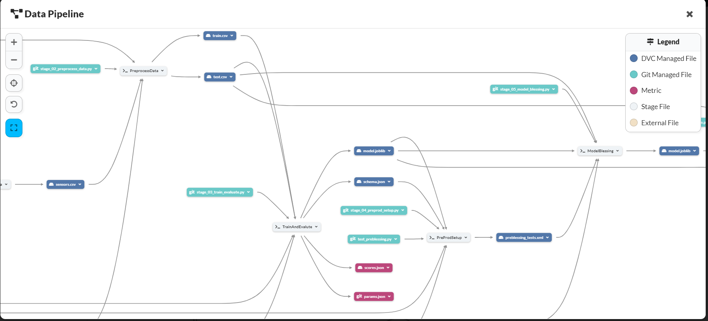

<p align="center">
    <b>
        <h1 align="center">Air Pressure System (APS) Fault Detection</h1>
    </b>
</p>
<p align="center">
<a href="https://github.com/Hassi34/aps-fault-detection">
    
</a>
</p>
<p align="center">
<a href="https://github.com/Hassi34/aps-fault-detection">
    
</a>
</p>

<p align="center">
    <a href="https://www.python.org/downloads/">
        
    </a>
    <a href="https://github.com/Hassi34/aps-fault-detection">
        
    </a>
    <a href="https://github.com/Hassi34/aps-fault-detection">
        
    </a>
    <a href="https://github.com/Hassi34/aps-fault-detection">
        
    </a>
    <a href="https://github.com/Hassi34/aps-fault-detection">
        
    </a>
    <a href="https://github.com/Hassi34/aps-fault-detection/blob/main/LICENSE">
        
    </a>
</p>

Following are the major contents to follow, you can jump to any section:

>   -  [Problem Statement](#prob-statement)<br>
>   -  [Solution Proposed](#sol-proposed)<br>
>   -  [Streaming Data pipeline (Kafka)](https://github.com/Hassi34/aps-fault-detection/blob/notebooks/streamingDataPipeline.ipynb)<br>
>   -  [Project Notebooks](https://github.com/Hassi34/aps-fault-detection/tree/notebooks)
>   - [Model Training on Databricks](https://github.com/Hassi34/aps-fault-detection/blob/notebooks/sensorFaultDetectionDatabricks.ipynb)
>   -  [Tech Stack](#tech-stack)<br>
>   -  [Infrastructure](#infra-)<br>
>   -  [DagsHub Data Pipeline](https://dagshub.com/hassi34/aps-fault-detection)
>   -  [Run Locally](#run-local)<br>
>      - [Environment Setup](#env-setup)<br>
>      - [Environment Variables](#env-vars)<br>
>      - [Run Pipeline](#run-pipeline)<br>
>   -  [Conclusion](#conclusion-)<br>

### Problem Statement<a id='prob-statement'></a>
The Air Pressure System (APS) is a critical component of a heavy-duty vehicle that uses compressed air to force a piston to provide pressure to the brake pads, slowing the vehicle down. The benefits of using an APS instead of a hydraulic system are the easy availability and long-term sustainability of natural air.

This is a Binary Classification problem, in which the affirmative class indicates that the failure was caused by a certain component of the APS, while the negative class
indicates that the failure was caused by something else.

### Solution Proposed<a id='sol-proposed'></a>
In this project, the system in focus is the Air Pressure system (APS) which generates pressurized air that are utilized in various functions in a truck, such as braking and gear changes. The datasets positive class corresponds to component failures for a specific component of the APS system. The negative class corresponds to trucks with failures for components not related to the APS system.

The problem is to reduce the cost due to unnecessary repairs. So it is required to minimize the false predictions.

## Model Training Pipeline


## Batch(Offline) Prediction Worflow


## CICD on Circleci



## DagsHub Data Pipeline
<br>
Complete Project Data Pipeline is available at [DagsHub Data Pipeline](https://dagshub.com/hassi34/aps-fault-detection)

## Tech Stack Used<a id='tech-stack'></a>
1. Python 
2. Data Version Control (DVC) 
3. Distributed Computing
4. Machine learning algorithms
5. MLFlow
6. MongoDB
7. SMTP Server

## Infrastructure<a id='infra-'></a>

1. AWS S3
2. Google Cloud Storage (GCS)
3. Databricks
4. GitHub
5. DaghsHub
6. CircleCi

## Run Locally<a id='run-local'></a>

* Ensure you have [Python 3.7+](https://www.python.org/downloads/) installed.

* Create a new Python Conda environment:<a id='env-setup'></a>

```bash
conda create -n venv python=3.10  
conda activate venv 
```
OR
* Create a new Python virtual environment with pip:
```bash
virtualenv venv --python=python3.10 
source venv/bin/activate
```
Install dependencies

```bash
  pip install -r requirements.txt
```

Clone the project

```bash
  git clone https://github.com/Hassi34/aps-fault-detection.git
```

Go to the project directory

```bash
  cd aps-fault-detection
```
Export the environment variable<a id='env-vars'></a>
```bash
#s3
AWS_ACCESS_KEY_ID_ENV_KEY=""
AWS_SECRET_ACCESS_KEY_ENV_KEY=""

#MONGO_DB
MONGO_DATABASE_NAME=""
MONGO_DB_URL=""

# MLFlow
MLFLOW_TRACKING_URI=""
MLFLOW_TRACKING_USERNAME=""
MLFLOW_TRACKING_PASSWORD=""

#GCP
JSON_DCRYPT_KEY=""
GCLOUD_SERVICE_KEY=""
CLOUDSDK_CORE_PROJECT=""
GOOGLE_COMPUTE_REGION=""
GOOGLE_COMPUTE_ZONE=""

#Email Alerts
EMAIL_PASS=""
SERVER_EMAIL=""
EMAIL_RECIPIENTS=""

```

Start Training and Serving Pipeline<a id='run-pipeline'></a>

```bash
  dvc init 
  dvc repro
```
## Conclusion<a id='conclusion-'></a>
This project is production ready to use the similar use cases and it will provide the automated and orchesrated production ready pipelines(Training & Serving)
#### **Thank you for visiting 🙏 If you find this project useful then don't forget to star the repo ✨⭐🤖**<br><br>

#### **📃 License**
[MIT][license] © [Hasanain][website]

[license]: hhttps://github.com/Hassi34/aps-fault-detection/blob/main/LICENSE
[website]: https://hasanain.aicaliber.com

Let's connect on **[``LinkedIn``](https://www.linkedin.com/in/hasanain-mehmood)** <br>